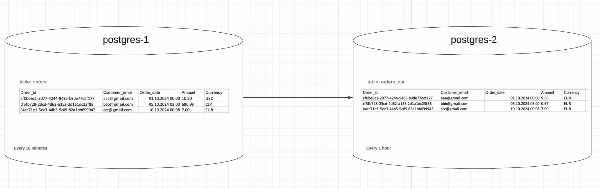

# Junior Data Engineer Solidgate

## Task

1. Create a script that will generate data **every 10 minutes** according to the structure below and write it into the `orders` table in the `postgres-1` database, which needs to be set up locally:

   - **order_id** (uuid)
   - **customer_email** (string)
   - **order_date** (datetime)
   - **amount** (float with 2 decimal places)
   - **currency** (string)

2. Every 10 minutes, 5000 new rows must appear in the table.

3. Deliver the data from this table to another local database (`postgres-2`) on an hourly basis.

4. The data in the table in `postgres-2` must be converted to a single currency – Euro. Let's call the table with converted amounts `orders_eur`.

## Additional Conditions

1. Scripts must run on Apache Airflow, which is set up locally in a Docker container.
2. For currency conversion, use information from the service: [OpenExchangeRate][1].

   The service has a free plan, which is sufficient to complete the task.

3. The `orders` and `orders_eur` tables can be extended with additional columns (if such are needed to complete the task).
4. The list of currencies for the generator can also be taken from the [OpenExchangeRate][1] service.
5. The table filled by the generator must contain data from the range “for the last 7 days” (i.e. `order_date between current_date - 7d and current_date`).

## Results

The solution must be provided as:

- `docker-compose.yaml` file
- `.py` files (with DAGs) needed to complete the tasks
- Uploaded to GitHub

[1]: https://docs.openexchangerates.org/reference/api-introduction
